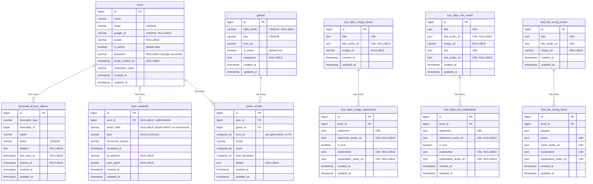

# SmartSprouts — Backend

[](https://smartsprouts.pp.ua)


Backend of **SmartSprouts** — a trilingual (EN/UK/ES) educational gaming platform that helps children build cognitive skills. This Laravel 10 REST API powers an early-stage startup MVP, built with production-grade backend engineering: a multi-provider content pipeline, a self-hosted TTS microservice, async queue processing, and GDPR-style privacy compliance.

- 🌐 **Live demo:** https://smartsprouts.pp.ua
- 💻 **Frontend (React SPA):** https://github.com/Roman-PRV/SmartSprouts-frontend
- 📊 **At a glance:** 430+ tests · 27 migrations · 3 languages · OpenAPI-documented

---

## Tech Stack

| Layer | Technology | Why |
|---|---|---|
| **Core** | Laravel 10 · PHP 8.2 | Mature framework, clear domain boundaries |
| **Auth** | Laravel Sanctum · Socialite (Google OAuth) | Token auth + social login; per-token revocation |
| **Data** | MySQL 8 · Redis 7 | Relational core + cache and queues |
| **Async** | Redis queues · dedicated queue-worker container | Slow work (TTS generation) offloaded off the request path |
| **Content i18n** | spatie/laravel-translatable | Per-field game-content translations (en/uk/es) |
| **AI & integrations** | DeepL · OpenAI · ElevenLabs · self-hosted TTS | Automated translation and generated speech |
| **Storage** | Cloudflare R2 (S3-compatible, `s3` Flysystem driver + custom endpoint) | Media offloaded to object storage |
| **API docs** | L5-Swagger (OpenAPI) | Contract-first; live "Authorize" via the Sanctum scheme |
| **Infra / DevOps** | Docker Compose (app, queue worker, MySQL, Redis, Nginx) · Coolify (Traefik) | 5-service prod stack; dev adds a profile-gated TTS service |
| **Testing** | PHPUnit 10 (SQLite in-memory) | 430+ tests across 55 suites |
| **Quality** | PHPStan / Larastan (level 5) · Laravel Pint · Husky · commitlint | Local pre-commit gate + static analysis |

---

## Engineering Highlights

- **Self-hosted TTS microservice** — Ukrainian speech synthesis runs in its own container, driven through a Redis queue and a dedicated worker; the provider is swapped by env (`TTS_PROVIDER`), so production uses ElevenLabs while local dev self-hosts Ukrainian-TTS and Kokoro.
- **Multi-provider content pipeline** — game content is authored once and machine-translated (DeepL / OpenAI) into en/uk/es via `spatie/laravel-translatable`, with generated audio per language.
- **Async by design** — slow work (audio generation) is offloaded to a dedicated `queue-worker` container, keeping request latency low.
- **GDPR-style privacy** — a versioned consent audit trail, a blocking consent gate (including the Google OAuth path), and account deletion that anonymizes but retains consent records via a keyed HMAC.
- **Contract-first API** — a full OpenAPI/Swagger spec with a working Sanctum "Authorize" flow across every protected endpoint.
- **Auth** — Sanctum tokens plus Google OAuth (Socialite); the current token is revoked on logout, and all tokens are revoked on password change.

---

## Domain

SmartSprouts helps children improve their cognitive skills through educational games. Accounts are held by an adult (parent or guardian) on behalf of a child.

---

## Getting Started

Clone both repositories:

```bash
git clone git@github.com:Roman-PRV/SmartSprouts-backend.git
# Frontend lives in the companion repository:
git clone git@github.com:Roman-PRV/SmartSprouts-frontend.git
```

The backend runs entirely in Docker. See [`DOCKER.md`](./DOCKER.md) for the full setup; in short, base services come from `docker-compose.yml` and dev overrides load automatically from `docker-compose.override.yml`. All Artisan/Composer commands run **inside the Laravel container**.

---

## Scripts

- `lint` — PHPStan (Larastan) static analysis at level 5 over `app`, `routes`, `config`.
- `format` — Laravel Pint auto-formatting to Laravel coding standards.
- `test` — the PHPUnit suite inside the Laravel container.
- `quality` — aggregate gate: Pint + PHPStan + PHPUnit (pre-commit / CI).
- `prepare` — initialize Husky git hooks (once, after install).
- `queue:restart` — restart the queue worker to apply PHP changes to daemonized workers.

---

## Database Schema

Domain and auth tables (standard Laravel `failed_jobs` / `password_reset_tokens` omitted for clarity). Translatable content is stored as JSON keyed by locale (`i18n`).


```mermaid
erDiagram
	direction TB
	users {
		bigint id PK
		varchar name
		varchar email "UNIQUE"
		varchar google_id "UNIQUE, NULLABLE"
		varchar avatar "NULLABLE"
		boolean is_admin "default false"
		varchar password "NULLABLE (Google accounts)"
		timestamp email_verified_at "NULLABLE"
		varchar remember_token
		timestamp created_at
		timestamp updated_at
	}

	personal_access_tokens {
		bigint id PK
		varchar tokenable_type
		bigint tokenable_id
		varchar name
		varchar token "UNIQUE"
		text abilities "NULLABLE"
		timestamp last_used_at "NULLABLE"
		timestamp expires_at "NULLABLE"
		timestamp created_at
		timestamp updated_at
	}

	user_consents {
		bigint id PK
		bigint user_id FK "NULLABLE, nullOnDelete"
		varchar email_hash "NULLABLE (keyed HMAC on anonymize)"
		varchar type "terms or privacy"
		varchar document_version
		timestamp accepted_at
		varchar ip_address "NULLABLE"
		varchar user_agent "NULLABLE"
		timestamp created_at
		timestamp updated_at
	}

	games {
		bigint id PK
		varchar table_prefix "UNIQUE, NULLABLE"
		varchar key "UNIQUE"
		varchar icon_url
		boolean is_active "default true"
		json categories "NULLABLE"
		timestamp created_at
		timestamp updated_at
	}

	game_results {
		bigint id PK
		bigint user_id FK
		bigint game_id FK
		unsigned_int level_id "per-game level, no FK"
		varchar locale
		unsigned_int score
		unsigned_int total_questions
		json details "NULLABLE"
		timestamp created_at
		timestamp updated_at
	}

	true_false_image_levels {
		bigint id PK
		json title "i18n"
		json title_audio_url "i18n, NULLABLE"
		varchar image_url "NULLABLE"
		timestamp created_at
		timestamp updated_at
	}

	true_false_image_statements {
		bigint id PK
		bigint level_id FK
		json statement "i18n"
		json statement_audio_url "i18n, NULLABLE"
		boolean is_true
		json explanation "i18n, NULLABLE"
		json explanation_audio_url "i18n, NULLABLE"
		timestamp created_at
		timestamp updated_at
	}

	true_false_text_levels {
		bigint id PK
		json title "i18n"
		json title_audio_url "i18n, NULLABLE"
		varchar image_url "NULLABLE"
		json text "i18n"
		json text_audio_url "i18n, NULLABLE"
		timestamp created_at
		timestamp updated_at
	}

	true_false_text_statements {
		bigint id PK
		bigint level_id FK
		json statement "i18n"
		json statement_audio_url "i18n, NULLABLE"
		boolean is_true
		json explanation "i18n, NULLABLE"
		json explanation_audio_url "i18n, NULLABLE"
		timestamp created_at
		timestamp updated_at
	}

	find_the_wrong_levels {
		bigint id PK
		json title "i18n"
		json title_audio_url "i18n"
		varchar image_url "NULLABLE"
		timestamp created_at
		timestamp updated_at
	}

	find_the_wrong_items {
		bigint id PK
		bigint level_id FK
		json polygon
		json name "i18n"
		json name_audio_url "i18n"
		json explanation "i18n"
		json explanation_audio_url "i18n"
		timestamp created_at
		timestamp updated_at
	}

	users ||--o{ personal_access_tokens : "has many"
	users ||--o{ user_consents : "has many"
	users ||--o{ game_results : "has many"
	games ||--o{ game_results : "has many"
	true_false_image_levels ||--o{ true_false_image_statements : "has many"
	true_false_text_levels ||--o{ true_false_text_statements : "has many"
	find_the_wrong_levels ||--o{ find_the_wrong_items : "has many"
```

---

## API Documentation

The API specification is available via Swagger UI.

- Local (development): http://localhost:3000/docs/api-docs.json or open Swagger UI at http://localhost:3000/api/documentation
- Production / staging: {REPLACE_WITH_YOUR_ENV_URL}/api/documentation

To regenerate the local spec if it is out of date:

```bash
# inside the Laravel container
php artisan l5-swagger:generate
```

---

## Folder Structure

```
SmartSprouts-backend/
├── laravel/                        # Laravel application root
│   ├── app/
│   │   ├── Console/                # Artisan commands
│   │   ├── Contracts/              # Interfaces / abstractions
│   │   ├── DTO/                    # Data Transfer Objects
│   │   ├── Enums/                  # PHP Enums
│   │   ├── Events/                 # Domain events
│   │   ├── Exceptions/             # Custom exception classes
│   │   ├── Facades/                # Laravel facades
│   │   ├── Games/                  # Game-specific logic (TrueFalseImage, TrueFalseText, …)
│   │   ├── Helpers/                # Global helper functions
│   │   ├── Http/                   # Controllers, Requests, Resources, Middleware
│   │   ├── Jobs/                   # Queue jobs (e.g. TTS generation)
│   │   ├── Listeners/              # Event listeners
│   │   ├── Models/                 # Eloquent models
│   │   ├── Providers/              # Service providers
│   │   ├── Services/               # Application services
│   │   │   ├── Media/              # Media processing
│   │   │   ├── Translation/        # Translation helpers
│   │   │   └── Tts/                # TTS orchestration, storage, providers
│   │   └── Traits/                 # Shared model traits (e.g. HasTtsAudio)
│   ├── config/                     # Laravel & custom config files (ai.php, games.php, …)
│   ├── database/                   # Migrations, seeders, factories
│   ├── docker/                     # Dockerfile, entrypoint.sh, PHP/OPcache config
│   ├── resources/                  # Views, lang files
│   ├── routes/                     # api.php, web.php, console.php
│   ├── storage/                    # Logs, cache, uploaded files
│   └── tests/
│       ├── Feature/                # Feature (HTTP-level) tests
│       └── Unit/                   # Unit tests
├── nginx/                          # Nginx virtual host config
├── python-services/
│   └── ukrainian-tts/              # Self-hosted Ukrainian TTS microservice
├── docker-compose.yml              # Base, prod-ready services (Coolify reads only this)
├── docker-compose.override.yml     # Dev overrides (auto-loaded by Docker Compose)
└── package.json                    # Root NPM scripts (lint, test, queue:restart, …)
```

---

## Development Flow

We follow [Conventional Commits](https://www.conventionalcommits.org/en/v1.0.0).

**Pull request title**
```
<type>: <ticket-title> <project-prefix>-<issue-number>
```
Example: `feat: add dashboard screen ss-123`

**Branch**
```
<issue-number>-<type>-<short-desc>
```
Examples: `123-feat-add-dashboard`, `34-fix-user-flow`

**Commit**
```
<type>: <description> <project-prefix>-<issue-number>
```
Examples: `feat: add dashboard component ss-45`, `fix: update dashboard card size ss-212`

### Kokoro TTS (dev only)

For Spanish and English TTS in local development, the project uses a self-hosted [Kokoro-82M](https://github.com/hexgrad/kokoro) container.

It is an **independent** Docker Compose project, not part of this repository.

#### Shared Docker network

Both projects communicate via an external Docker network `dev-local-network`.
This network is declared in `docker-compose.override.yml` (dev only) and **does not affect production**.

Create it **once** before the first run:

```bash
docker network create dev-local-network
```

#### Starting Kokoro

```bash
cd D:/Coding/pet-project/Kokoro/docker/kokoro
docker compose up -d --build
```

After start, the service is available inside the Docker network at:
```
http://kokoro-tts:8880
```

#### Environment variables

Ensure the following are set in `.env` (see `.env.example`):

```ini
KOKORO_TTS_BASE_URL=http://kokoro-tts:8880/tts
KOKORO_TTS_DEFAULT_VOICE=af_heart
KOKORO_TTS_VOICE_EN=af_heart
KOKORO_TTS_VOICE_ES=ef_dora
```

> Kokoro provider is active **only** in `APP_ENV=local`. Production uses ElevenLabs.

### Ukrainian TTS

Microservice for Ukrainian speech synthesis. Uses the [robinhad/ukrainian-tts](https://github.com/robinhad/ukrainian-tts) model.

#### How to change the voice

1. Open `laravel/.env`.
2. Change the value of `UKRAINIAN_TTS_SPEAKER` to one of the speakers available below.
3. Restart the queue worker inside the Laravel container (or use the `queue:restart` script described in the Scripts section) to apply the changes:
   ```bash
   php artisan queue:restart
   ```

#### Available voices

| Voice | Gender | Example |
| :--- | :--- | :--- |
| **Oleksa** | Male | Deep, announcer-like |
| **Tetiana** | Female | Gentle, natural |
| **Dmytro** | Male | Neutral, universal |
| **Lada** | Female | Emotional, expressive |
| **Mykyta** | Male | Young timbre |

---

## Contributors

- **Prokopenko Roman** — GitHub: [roman-prv](https://github.com/Roman-PRV), Discord: _@roman_27794_
