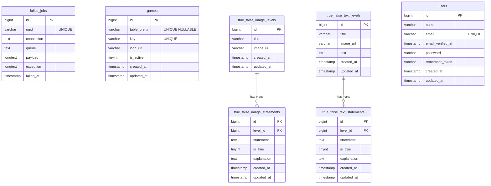

# SmartSprouts Backed

SmartSprouts Backend is a web application component developed for the SmartSprouts educational platform. Built on the Laravel 10 framework and the PHP programming language, it provides a reliable and scalable backend.

## 1. Domain

This app helps children improve their cognitive skills.

---

## 2. Tech Stack

- Backend: Laravel 10
- DB: MySQL 8.0
- Bundler: Vite
- Containerization: Docker + Docker Compose
- Testing: PHPUnit
- Code Quality: Laravel Pint, PHPStan
- Commit Control: Husky + Commitlint
- API Documentation: Swagger (L5-Swagger)

---

## 3. Installation

Clone the repository and install dependencies:

```
Backend component:
git clone git@github.com:Roman-PRV/SmartSprouts-backend.git

Frontend component:
git clone git@github.com:Roman-PRV/SmartSprouts-frontend.git
See the instructions in the corresponding repository.
```

## 4. Scripts

- `lint` Runs PHPStan inside the Laravel container to perform static code analysis at the highest level (max). Helps catch bugs and enforce code quality.
- `format` Executes Laravel Pint inside the container to automatically format PHP code according to Laravel's coding standards.
- `test` Runs Laravel's PHPUnit test suite inside the container to validate application logic and ensure everything works as expected.
- `quality` Aggregates all quality checks: formatting (pint), static analysis (phpstan), and tests (phpunit). Ideal for pre-commit or CI pipelines.
- `prepare` Initializes Husky Git hooks. Required once after installing dependencies to enable commit message and pre-commit checks.

## 5. Database Schema


## 6. API Documentation

The API specification is available via Swagger UI.

- Local (development): http://localhost:3000/docs/api-docs.json or open Swagger UI at http://localhost:3000/api/documentation
- Production / staging: {REPLACE_WITH_YOUR_ENV_URL}/api/documentation

To regenerate the local spec if it is out of date:

```bash
# inside the Laravel container
php artisan l5-swagger:generate
# make the spec public (if your setup requires it)
mkdir -p public/docs && cp storage/api-docs/api-docs.json public/docs/api-docs.json
```

## 7. Folder Structure

## 8. Development Flow

### 8.1 Pull Request Flow

```
<type>: <ticket-title> <project-prefix>-<issue-number>
```

For the full list of types check [Conventional Commits](https://github.com/conventional-changelog/commitlint/tree/master/%40commitlint/config-conventional)

Examples:

- `feat: add dashboard screen ss-123`

### 8.2 Branch Flow

```
<issue-number>-<type>-<short-desc>
```

Examples:

- `123-feat-add-dashboard`
- `12-feat-add-user-flow`
- `34-fix-user-flow`

### 8.3 Commit Flow

We use [Conventional Commits](https://www.conventionalcommits.org/en/v1.0.0) to handle commit messages

```
<type>: <description> <project-prefix>-<issue-number>
```

Examples:

- `feat: add dashboard component ss-45`
- `fix: update dashboard card size ss-212`

## 9. Contributors:

- **Prokopenko Roman** github: _roman-prv_, discord: _@roman_27794_
